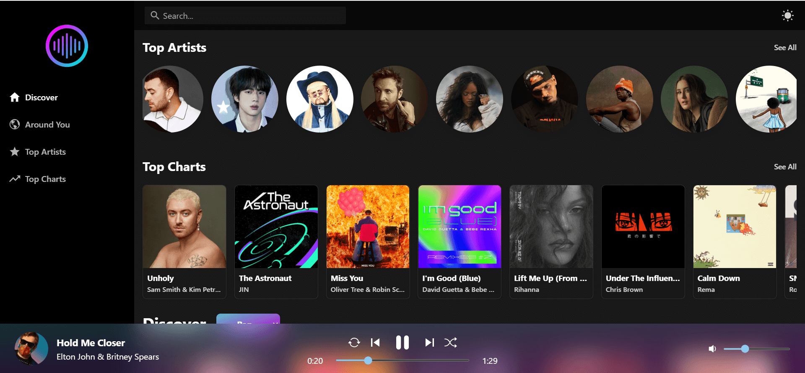

# Music App

####

Cloud Music Player using React, Redux Toolkit, and Tailwind CSS

&nbsp;

## 🎉 Live Site

[View Live](https://music-app.mostafaellethy.com/)

&nbsp;

## 📸 Screenshot



&nbsp;

## ✨ Features

<ul>
  <li>Stunning Responsive UI</li>
  <li>Customizable Theme</li>
  <li>Dark & Light Mode</li>
  <li>
  <details>
  <summary>Music Player Controls</summary>
    <ol>
        <li>Play / Pause</li>
        <li>Prev / Next</li>
        <li>Volume Bar</li>
        <li>Shuffle & Loop</li>
        <li>Seek Bar</li>
    </ol>
</details>
</li>
  <li>Search</li>
  <li>Songs by Genre</li>
  <li>Songs around You</li>
  <li>Top World Charts</li>
  <li>Top Artists</li>
  <li>Containerized</li>
</ul>

&nbsp;

## Built With

- [React](https://reactjs.org/)
- [Redux Toolkit](https://redux-toolkit.js.org/)
- [Vite](https://vitejs.dev/)
- [Typescript](https://www.typescriptlang.org/)
- [Tailwind CSS](https://tailwindcss.com/)

&nbsp;

## Setup

```bash
# Install dependencies
$ npm install

# Compiles and hot-reloads for development
$ npm run dev

# Compiles and minifies for production
$ npm run build
```
